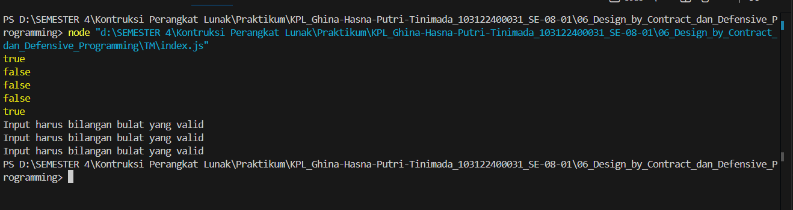

# Tugas Pendahuluan 06  
## Design by Contract & Defensive Programming (JavaScript)

**Nama:** Ghina Hasna Putri Tinimada  
**NIM:** 103122400031
**Kelas:** SE-08-01  

---

## Deskripsi Tugas

Tugasmu adalah membuat fungsi yang menolak bilangan-bilangan kelipatan 3, 5, atau 15, menerima bilangan-bilangan bukan "fizz buzz", dan melempar yang bukan bilangan bulat.

---

## Kode Sumber

[index.js](index.js)
---

## Output 

---

## Deskripsi Program

Program ini berfungsi untuk mengecek apakah suatu angka bukan termasuk FizzBuzz. Pertama, program memvalidasi input agar benar-benar berupa bilangan bulat yang valid. Jika input bukan angka, NaN, Infinity, atau bukan bilangan bulat, maka program akan menampilkan error.

Setelah itu, program mengecek apakah angka tersebut habis dibagi 3 atau 5. Jika iya, fungsi akan mengembalikan nilai false (artinya termasuk FizzBuzz). Jika tidak habis dibagi 3 maupun 5, fungsi akan mengembalikan true (artinya bukan FizzBuzz).

Di bagian akhir, program menguji beberapa nilai dan menampilkan hasilnya ke console. Selain itu, digunakan blok try-catch untuk menangani input yang tidak valid agar error bisa ditampilkan tanpa menghentikan program.