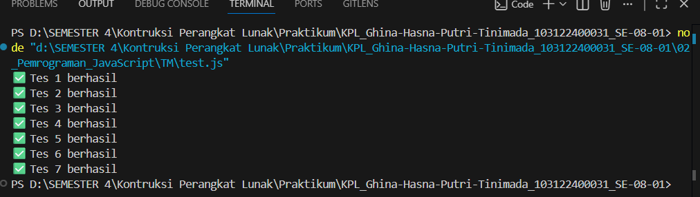

# Tugas Mandiri: Pemrograman Javascript

**Nama:** Ghina Hasna Putri Tinimada

**NIM:** 103122400031

**Kelas:** SE-08-01

## Soal
Buatlah sebuah fungsi bernama fizzBuzz yang menerima input larik (array) dan mengembalikan deretan bilangan dan "Fizz" untuk kelipatan 2, "Buzz" untuk kelipatan 7, dan "FizzBuzz" untuk kelipatan 14. Beri nama berkas program sebagai tm.js dan taruh di direktori TM.

## Kode Sumber
[tm.js](tm.js)

## Output

## Deskripsi Program

Program ini bikin fungsi fizzBuzz yang menerima array angka. Setiap angka dicek pakai perulangan. Kalau kelipatan 2 jadi "Fizz", kelipatan 7 jadi "Buzz", dan kelipatan 14 jadi "FizzBuzz". Kalau tidak memenuhi kondisi itu, angkanya tetap ditampilkan. Hasilnya digabung jadi satu teks lalu dikembalikan sebagai output.
