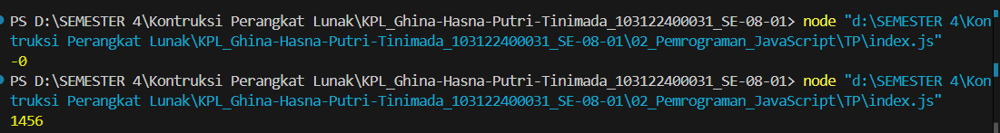

# Tugas Pendahuluan 02: Pemrograman JavaScript

**Nama:** Ghina Hasna Putri Tinimada
**NIM:** 103122400031
**Kelas:** SE-08-01

## Soal

Kamu sudah menulis fungsi mulOfArray. Ujilah dengan input [2, 0, 26, 28, -2], dengan output yang seharusnya adalah 1456. Jika kamu menemukan bahwa hasilnya berbeda, bisakah kamu memperbaikinya? Jika kamu menemukan bahwa hasilnya sama, bisakah kamu menjelaskan mengapa demikian?

## Jawaban 

pada kode pertama tidak ada kondisi, sehingga semua nilai array termasuk 0 dan -2 ikut dikalikan.
Pada kode kedua terdapat if (arr[i] > 0), sehingga hanya angka positif yang dikalikan dan nilai 0 serta -2 dilewati, sehingga hasilnya menjadi 1456.

Hal ini menyebabkan hasil kedua kode berbeda. Pada kode pertama, karena angka 0 ikut dikalikan, maka hasil akhirnya menjadi 0 karena perkalian dengan 0 selalu menghasilkan 0. Sedangkan pada kode kedua, angka 0 dan -2 tidak diproses sehingga yang dikalikan hanya 2, 26, dan 28, sehingga menghasilkan 1456.

## Output

## Deskripsi programm

Program tersebut merupakan fungsi JavaScript bernama mulOfArray yang digunakan untuk menghitung hasil perkalian dari elemen-elemen dalam sebuah array. Program melakukan perulangan untuk mengambil setiap nilai pada array lalu mengalikannya ke variabel hasil.