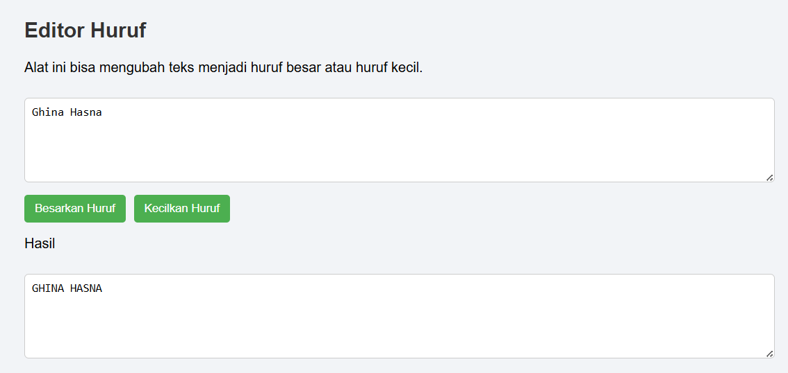
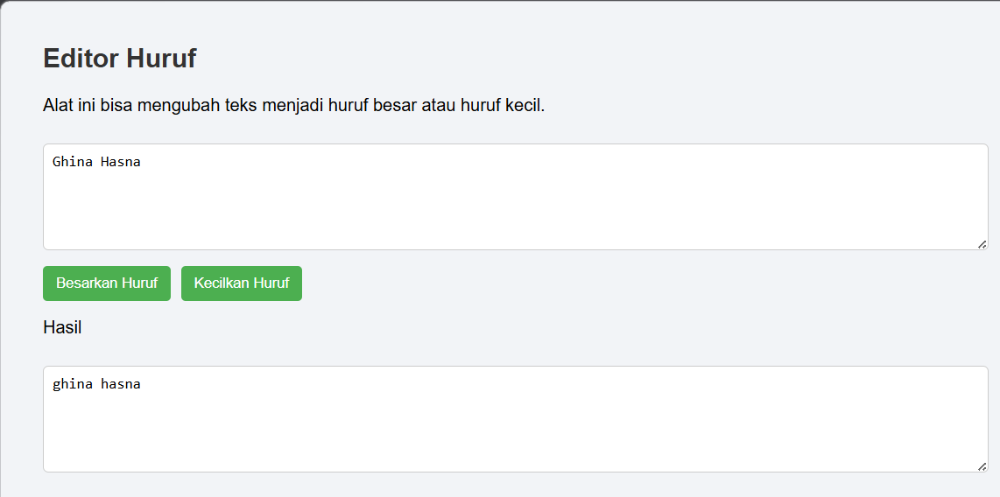

#  Tugas Mandiri 03: GUI dengan HTML dan CSS

**Nama:** Ghina Hasna Putri Tinimada

**NIM:** 103122400031

**Kelas:** SE-08-01

## Soal

 terapkanlah fungsi untuk (1) menghitung huruf kecil yang disediakan di #hk, (2) mengubah huruf kecil ke huruf besar ketika pengguna menekan tombol #huruf-besar, dan (3) mengubah huruf besar ke huruf kecil ketika pengguna menekan tombol #huruf-kecil.

Untuk nomor 2 dan 3, tampilkan hasilnya di dalam editor-kecil.

Kemudian, hapuslah fitur "Paragrafkan" dari alat.

## kode Sumber
[index.html](index.html) [script.js](script.js) [style.css](style.css)

## Output

## Deskripsi programm

Program ini adalah editor teks sederhana. Pengguna bisa mengetik teks di kotak yang tersedia, lalu menekan tombol untuk mengubah semua huruf menjadi huruf besar atau huruf kecil. Setelah tombol ditekan, hasilnya akan langsung muncul di kotak hasil di bawahnya. Jadi pengguna bisa langsung melihat perubahan teks yang sudah diproses.