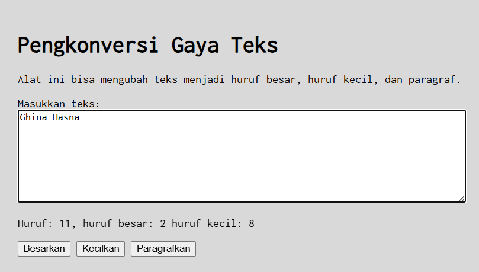

# Tugas Praktikum 03: GUI dengan HTML dan CSS 

**Nama**  : Ghina Hasna Putri Tinimada
**Nim**   : 103122400031
**kelas** : SE-08-01

## Soal

Buatlah tata letak laman yang berada di tengah seperti pada gambar yang diberikan. Ubah font menggunakan Inconsolata dari Google Fonts.

Laman harus memiliki:

- Area untuk memasukkan teks
- Informasi jumlah huruf, huruf besar, dan huruf kecil
- Tombol untuk mengubah teks menjadi huruf besar, huruf kecil, dan paragraf

## Jawaban

Di tugas ini aku bikin halaman web sederhana buat mengubah gaya teks pakai HTML, CSS, dan JavaScript. HTML dipakai buat struktur halaman seperti judul, tempat input teks, info jumlah huruf, dan tombol. CSS dipakai buat ngatur tampilan supaya halaman ada di tengah dan pakai font Inconsolata dari Google Fonts. JavaScript dipakai buat fungsi seperti menghitung jumlah huruf dan mengubah teks jadi huruf besar, huruf kecil, atau paragraf.

---

## Kode Sumber
 [ini codenya](index.html)
 [ini codenya](style.css)
 [ini codenya](script.js)

## Output:

--- 

## Deskripsi Program

Program ini berfungsi untuk mengubah gaya teks yang dimasukkan oleh pengguna. Teks dapat diubah menjadi huruf besar, huruf kecil, atau format paragraf menggunakan tombol yang tersedia. Program juga menampilkan informasi jumlah huruf, huruf besar, dan huruf kecil secara otomatis saat pengguna mengetik.