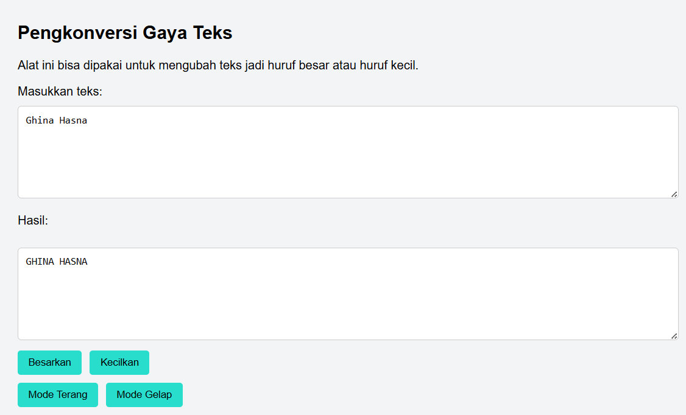
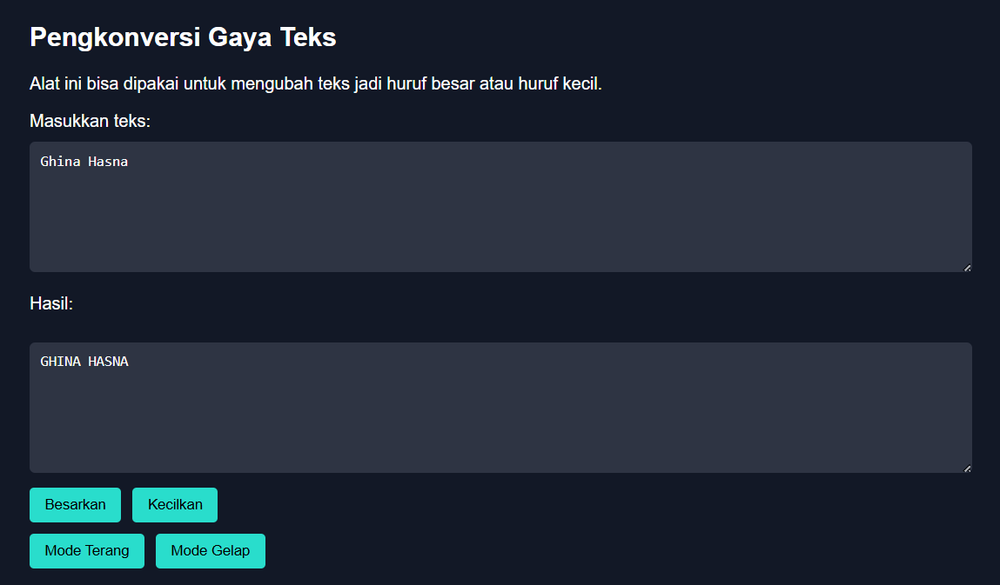

#  Tugas Pendahuluan 04: Automata dan Table-Driven Construction

**Nama:** Ghina Hasna Putri Tinimada

**NIM:** 103122400031

**Kelas:** SE-08-01

## Soal
Tambahkan mode gelap sekaligus untuk editor-kecil dan tombol-tombolnya. Ketentuan warna untuk latar belakang editor-kecil adalah #2e3443, sementara untuk tombol adalah #29ddcc. Teks untuk tombol tetap mengikuti warna teks sebelumnya.

Untuk menghapus pinggiran tombol, nyatakan properti border untuk tidak ditunjukkan.

## kode Sumber
[index.html](index.html) [script.js](script.js) [style.css](style.css)

## Output

## Mode Terang

## Mode Gelap

## Deskripsi programm

Program ini dipakai buat mengubah teks dengan cara yang simpel. Pengguna tinggal masukin teks ke kotak yang ada, lalu bisa pilih tombol untuk bikin semua huruf jadi besar atau jadi kecil. Hasilnya bakal langsung muncul di kotak hasil di bawah. Selain itu ada juga pilihan mode terang dan mode gelap supaya tampilannya bisa disesuaikan biar lebih nyaman dilihat.