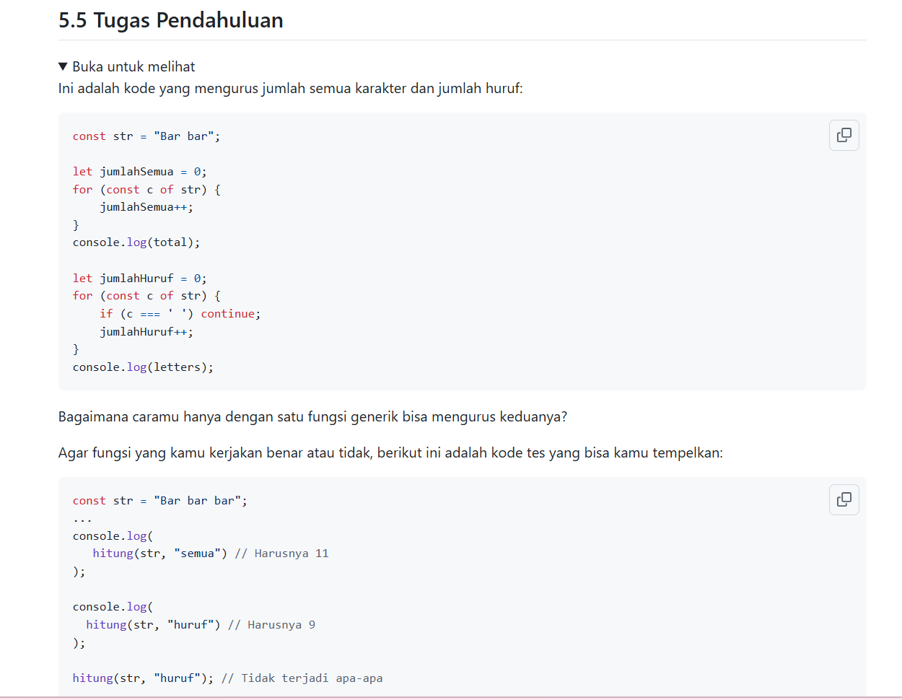
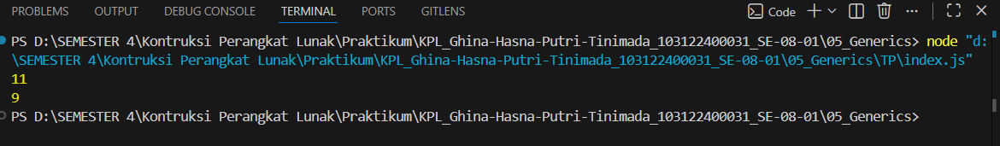

# Tugas Pendahuluan 05: Generics

  **Nama** : Ghina Hasna Putri Tinimada  
  **NIM** : 103122400031  
  **Kelas** : SE-08-01  
  

**Soal**

**Kode sumber**

[index.js](index.js)

**Output**

**Deskripsi Program**

Program ini digunakan untuk menghitung jumlah karakter pada sebuah teks.
Fungsi hitung() menerima parameter string dan tipe perhitungan. Jika tipe "semua", maka seluruh karakter termasuk spasi dihitung. Jika tipe "huruf", spasi tidak ikut dihitung.
Perulangan digunakan untuk membaca setiap karakter, kemudian jumlahnya ditambahkan dan hasilnya dikembalikan.
