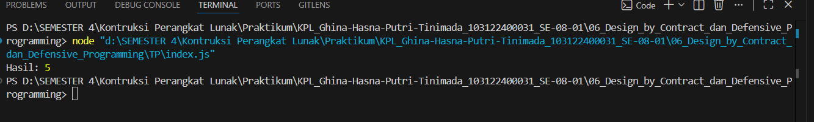

# Tugas Pendahuluan 06  
## Design by Contract & Defensive Programming (JavaScript)

**Nama:** Ghina Hasna Putri Tinimada  
**NIM:** 103122400031
**Kelas:** SE-08-01  

---

## Deskripsi Tugas

Pada tugas ini diminta untuk mengimplementasikan dan membandingkan dua pendekatan dalam menangani kesalahan pada program, yaitu Design by Contract (menggunakan assertion) dan Defensive Programming (menggunakan exception) melalui studi kasus fungsi `divide(a, b)`.

Fungsi ini digunakan untuk melakukan operasi pembagian dua bilangan dengan beberapa aturan validasi, yaitu parameter harus berupa number dan tidak boleh melakukan pembagian dengan nol. Kedua pendekatan digunakan untuk memahami perbedaan cara menangani error, apakah sebagai pelanggaran kontrak internal atau sebagai kesalahan input yang harus ditangani secara eksplisit.

---

## Kode Sumber

---

## Output 

---

## Deskripsi Program

Program ini digunakan untuk melakukan pembagian dua angka dengan memastikan input yang diberikan valid. Sebelum melakukan perhitungan, program mengecek apakah kedua parameter berupa angka. Jika bukan angka, maka akan muncul error. Selain itu, program juga mencegah pembagian dengan nol dengan memberikan error khusus. Proses pembagian dijalankan di dalam blok try-catch agar jika terjadi kesalahan, program tidak berhenti tiba-tiba dan pesan error dapat ditampilkan dengan jelas.