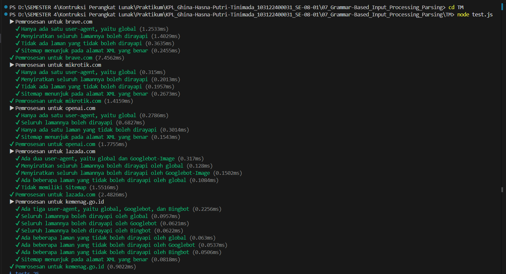

# Tugas Mandiri 07 :  	07_Grammar-Based_Input_Processing_Parsing  

  **Nama** : Ghina Hasna Putri Tinimada
  **NIM** : 103122400031
  **Kelas** : SE-08-01  

## Tugas

Uraikan robot!

Tugas pada kesempatan kali ini adalah membuat fungsi yang menguraikan isi robots.txt menjadi POJO (plain old JavaScript object). Empat properti yang perlu diuraikan dijabarkan di bawah berikut.

User-agent adalah nama robot perayapnya
Allow adalah daftar halaman-halaman yang boleh dirayap
Disallow adalah daftar halaman-halaman yang tidak boleh dirayap
Sitemap adalah sebuah pranala yang menunjuk pada "denah" situs web (biasanya berformat XML)
Kamu akan mengerjakannya di dalam sebuah fungsi bernama parseRobots di index.js dan. Buka direktori 07 di sini untuk mengunduh berkas yang dimaksud, berkas-berikas robots.txt di dalam direktori daftar, dan berkas pengujiannya yaitu test.js.

## Program/Kode

Tersedia di [index.js](./index.js).
Tersedia di [test.js](./test.js).

## Output

## Deskripsi

Program ini merupakan parser untuk file robots.txt yang digunakan untuk mengekstrak aturan perayapan (crawling rules) dari suatu website. Robots.txt berisi informasi mengenai bagaimana mesin pencari seperti Googlebot atau Bingbot diperbolehkan atau dilarang mengakses halaman tertentu pada sebuah situs web.
Program ini dibuat menggunakan JavaScript (Node.js) dan berfungsi untuk membaca isi file robots.txt, kemudian mengubahnya menjadi struktur data yang terorganisir agar mudah diproses lebih lanjut oleh sistem.