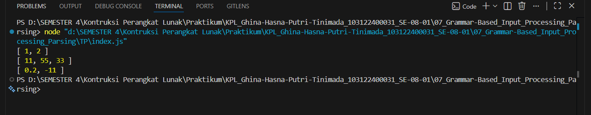

# Tugas Pendahuluan 
## Fungsi toNumberArray (JavaScript)

**Nama:** Ghina Hasna Putri Tinimada

**NIM:** 103122400031

**Kelas:** SE-08-01  

---

## Deskripsi Tugas

Buatlah fungsi yang mengubah deretan angka bertipe string menjadi larik angka.

---

## Output

---

## Deskripsi Program

Program ini menggunakan fungsi split() untuk memisahkan data berdasarkan tanda koma, trim() untuk menghapus spasi yang tidak diperlukan, Number() untuk mengubah string menjadi tipe data angka, map() untuk memproses setiap data dalam array, dan filter() serta isNaN() untuk menyaring data yang bukan angka valid.
---

## Kesimpulan

Program berhasil mengubah string berisi angka menjadi array number dengan baik. Selain itu, program juga dapat menangani spasi, angka desimal, angka negatif, dan mengabaikan data yang tidak valid sehingga hasil yang diperoleh lebih rapi dan sesuai kebutuhan.
