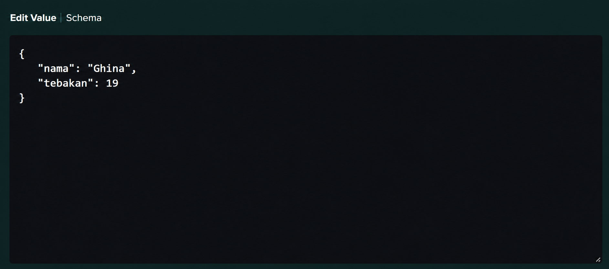
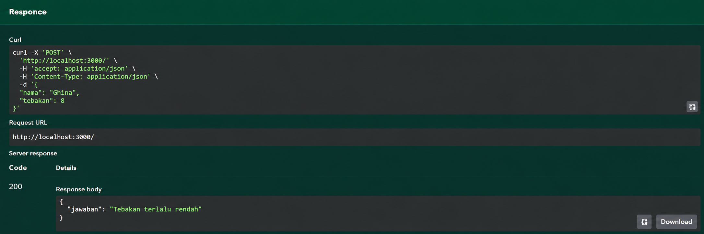
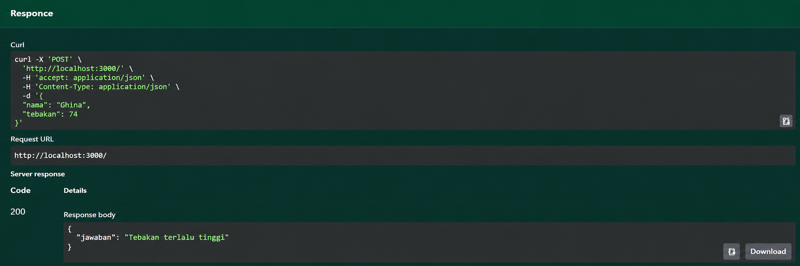
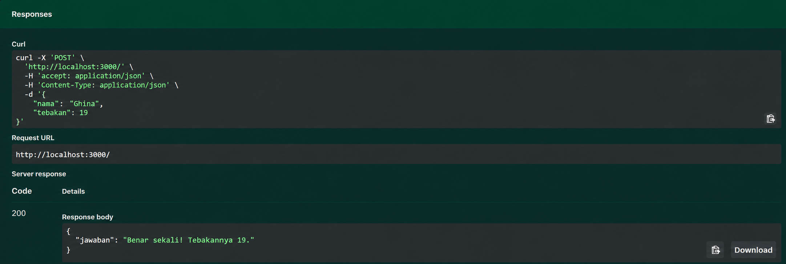

# Tugas Mandiri 09
## API Tebak Angka Acak Tetap Berdasarkan Nama

**Nama:** Ghina Hasna Putri Tinimada 
**NIM:** 103122400031
**Kelas:** SE-08-01  

---

## Deskripsi Tugas

Pada tugas mandiri ini diminta untuk membuat sebuah API sederhana menggunakan **Node.js** dan **Express.js**. API ini digunakan untuk permainan tebak angka, di mana pengguna mengirimkan nama dan angka tebakan melalui request `POST`.

API hanya memiliki satu endpoint utama, yaitu:

```http
POST /
```

Request dikirim dalam format JSON dengan data berupa nama pemain dan angka tebakan. Sistem kemudian akan menentukan sebuah angka acak tetap berdasarkan nama pemain tersebut. Jika tebakan sesuai dengan angka yang ditentukan, maka API akan mengembalikan jawaban bahwa tebakan benar. Jika tebakan terlalu tinggi atau terlalu rendah, API akan memberikan pesan sesuai kondisi tersebut.

---

## Ketentuan Tugas

Program harus memenuhi beberapa ketentuan berikut:

1. API terdiri dari satu endpoint saja, yaitu `POST /`
2. Angka yang dihasilkan harus tetap untuk nama yang sama
3. Angka boleh berbeda untuk nama yang berbeda
4. Rentang angka harus berada di antara 1 sampai 100
5. Nama bersifat sensitif terhadap huruf besar dan huruf kecil
6. Tidak menggunakan pustaka apa pun untuk menentukan angka berdasarkan nama dan tebakan
7. Response dikembalikan dalam format JSON

---

## Output Program





---

## Code Program 
[index.js](./index.js)
[swagger.js](./swagger.js)

---

## Deskripsi Program

Program ini merupakan layanan API sederhana yang digunakan untuk permainan tebak angka. Sistem menerima permintaan POST yang berisi nama pengguna dan angka tebakan. Berdasarkan nama yang diberikan, program menghasilkan sebuah angka target yang selalu sama untuk nama tersebut sehingga hasilnya konsisten pada setiap permintaan.

Setelah menerima data, API akan membandingkan angka tebakan dengan angka target yang telah dihasilkan. Jika tebakan sesuai, sistem mengembalikan pesan bahwa tebakan benar beserta angka yang dimaksud. Jika nilai tebakan lebih besar dari angka target, API memberikan respons bahwa tebakan terlalu tinggi. Sebaliknya, jika nilainya lebih kecil, sistem akan menginformasikan bahwa tebakan terlalu rendah. Dengan pendekatan ini, setiap nama memiliki angka rahasia yang unik dan tetap berada dalam rentang 1 sampai 100.

## Kesimpulan

Pada tugas ini berhasil dibuat sebuah REST API menggunakan Swagger yang memiliki satu endpoint POST untuk permainan tebak angka. API dapat menerima input berupa nama dan angka tebakan, kemudian menghasilkan respons yang sesuai berdasarkan hasil perbandingan dengan angka rahasia yang dibangkitkan dari nama pengguna. Implementasi ini memenuhi ketentuan bahwa setiap nama akan selalu menghasilkan angka yang sama, bersifat sensitif terhadap huruf besar dan kecil, serta menggunakan rentang angka 1–100 tanpa memanfaatkan pustaka tambahan untuk proses pengacakan. Dengan demikian, API dapat digunakan sebagai layanan permainan tebak angka yang konsisten dan mudah didokumentasikan menggunakan Swagger.