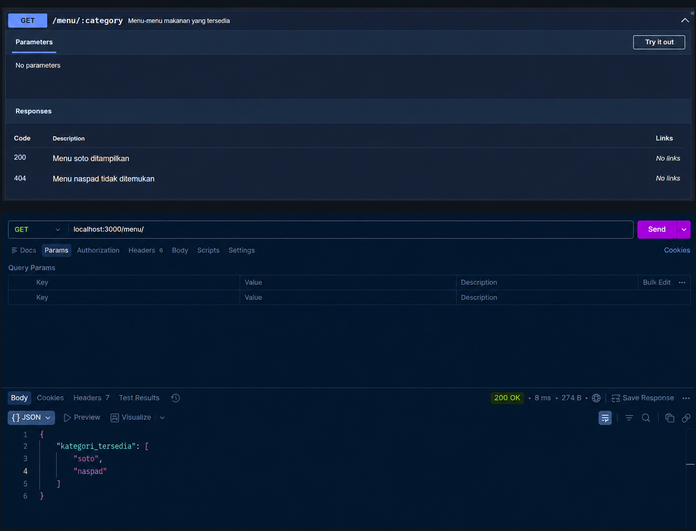

# Tugas Pendahuluan 09
## Endpoint GET `/menu` dengan Dokumentasi OpenAPI

**Nama:** Ghina Hasna Putri Tinimada 
**NIM:** 103122400031
**Kelas:** SE-08-01  

---

## Deskripsi Tugas

Pada tugas pendahuluan ini diminta untuk membuat satu endpoint tambahan beserta dokumentasi OpenAPI-nya. Endpoint yang dibuat adalah:

```http
GET /menu
```

Endpoint tersebut digunakan untuk menampilkan daftar semua nama kategori menu yang tersedia. Data menu disimpan dalam bentuk object JavaScript, kemudian kategori menu diambil menggunakan method `Object.keys()`.

API ini dibuat menggunakan **Node.js**, **Express.js**, dan dokumentasi API dibuat menggunakan **Swagger OpenAPI**.

---

## Ketentuan Tugas

Program harus memenuhi beberapa ketentuan berikut:

1. Membuat endpoint `GET /menu`
2. Endpoint menampilkan semua nama kategori menu yang tersedia
3. Response dikembalikan dalam format JSON
4. Membuat dokumentasi OpenAPI untuk endpoint `GET /menu`
5. Dokumentasi dapat diakses melalui Swagger UI
6. API berjalan pada port `3000`

---

## Output Program



---

## Deskripsi Program

Program ini merupakan aplikasi REST API sederhana menggunakan Node.js, Express.js, dan Swagger (OpenAPI). Program dibuat untuk menyediakan endpoint GET /menu yang berfungsi menampilkan seluruh kategori menu yang tersedia. Data menu disimpan dalam bentuk array objek yang memiliki atribut nama menu dan kategori. Saat endpoint dipanggil, program akan mengambil seluruh nilai kategori dari data menu, menghapus kategori yang duplikat menggunakan Set, kemudian mengembalikannya dalam format JSON. Selain itu, program juga dilengkapi dengan dokumentasi Swagger sehingga pengguna dapat melihat dan mencoba endpoint API secara langsung melalui halaman /api-docs.

---

## Kesimpulan

Melalui pembuatan endpoint GET /menu, aplikasi berhasil menyediakan layanan untuk menampilkan daftar kategori menu yang tersedia tanpa adanya data yang berulang. Integrasi Swagger memudahkan proses dokumentasi dan pengujian API karena pengguna dapat memahami fungsi endpoint serta mencoba request secara langsung. Dengan demikian, program ini menunjukkan penerapan dasar pembuatan REST API beserta dokumentasi OpenAPI yang terstruktur dan mudah digunakan.