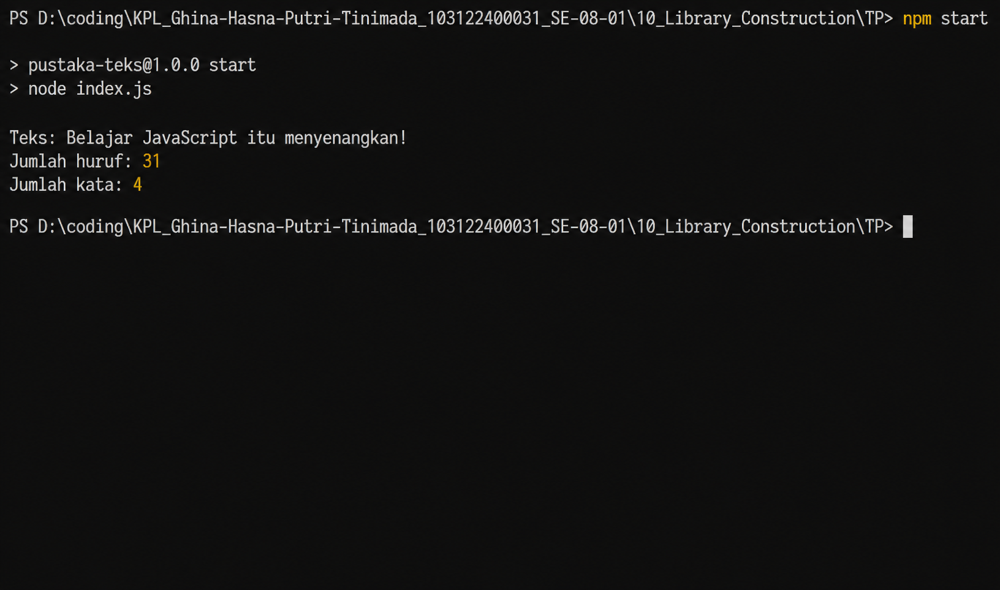

# Tugas Pendahuluan 10
## Pustaka JavaScript Penghitung Jumlah Huruf dan Kata

**Nama:** Ghina Hasna Putri Tinimada 
**NIM:** 103122400031 
**Kelas:** SE-08-01  

---

## Deskripsi Tugas

Pada tugas pendahuluan ini diminta untuk membuat sebuah pustaka JavaScript yang menyediakan utilitas berupa dua fungsi. Fungsi pertama digunakan untuk menghitung jumlah huruf, sedangkan fungsi kedua digunakan untuk menghitung jumlah kata.

Pustaka ini hanya menghitung karakter alfabet dari `A` sampai `Z`, baik huruf besar maupun huruf kecil. Karakter selain huruf, seperti angka, simbol, tanda baca, dan spasi tidak dihitung sebagai huruf.

Pustaka dibuat agar dapat digunakan kembali pada file JavaScript lain dengan cara diimpor menggunakan `import`.

---

## Deskripsi Program

Program ini merupakan pustaka JavaScript sederhana yang menyediakan dua fungsi utilitas untuk mengolah teks, yaitu menghitung jumlah huruf dan jumlah kata dalam sebuah kalimat atau paragraf. Fungsi countLetters() digunakan untuk menghitung jumlah huruf alfabet A–Z (huruf besar maupun kecil) tanpa memperhitungkan spasi, angka, maupun simbol. Sementara itu, fungsi countWords() digunakan untuk menghitung jumlah kata berdasarkan pemisahan oleh spasi. Pustaka ini dibuat menggunakan konsep ES Module sehingga dapat diimpor dan digunakan kembali pada file JavaScript lainnya. Program ini cocok digunakan sebagai dasar pengolahan teks sederhana dalam aplikasi JavaScript.

---

## Output 

---

## Kesimpulan 
Program pustaka JavaScript ini berhasil dibuat untuk menyediakan dua fungsi utilitas, yaitu menghitung jumlah huruf dan jumlah kata pada sebuah teks. Fungsi countLetters() hanya menghitung karakter alfabet A–Z (huruf besar dan kecil) sehingga angka, simbol, dan spasi tidak ikut dihitung. Sementara itu, fungsi countWords() digunakan untuk menghitung jumlah kata berdasarkan pemisah spasi. Program telah menggunakan konsep ES Module sehingga dapat diimpor dan digunakan kembali pada file lain. Berdasarkan hasil pengujian, program mampu menghasilkan jumlah huruf dan jumlah kata secara akurat sesuai dengan kriteria yang telah ditentukan.