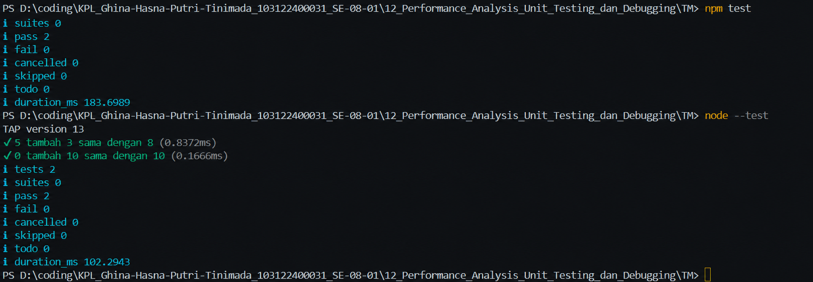

# Tugas Mandiri 12: Performance_Analysis_Unit Testing_ dan_Debugging

  **Nama** : Ghina Hasna Putri Tinimada 
  **NIM** : 103122400031 
  **Kelas** : SE-08-01  

## Tugas

Bisakah kamu tunjukkan apakah kode sudah benar atau bagian mana yang perlu diperbaiki beserta alasannya?

## Program/Kode

File test: [hitung.js](./hitung.js), [hitung-test.js](./hitung-test.js)

## Output

## Deskripsi

Program ini merupakan file unit testing yang digunakan untuk menguji fungsi tambahPenghitung() pada Node.js. Pengujian dilakukan menggunakan modul node:test sebagai framework testing dan node:assert untuk melakukan validasi hasil. Fungsi tambahPenghitung() diimpor dari file hitung.js, kemudian diuji melalui dua skenario. Skenario pertama memeriksa apakah penjumlahan nilai 5 dan 3 menghasilkan 8, sedangkan skenario kedua memeriksa apakah penjumlahan nilai 0 dan 10 menghasilkan 10. Pada setiap pengujian digunakan assert.strictEqual() untuk membandingkan hasil aktual dengan hasil yang diharapkan. Jika kedua nilai sama, maka pengujian dinyatakan berhasil (pass). Tujuan dari program ini adalah memastikan bahwa fungsi penjumlahan bekerja sesuai spesifikasi dan membantu mendeteksi kesalahan sejak tahap pengembangan perangkat lunak.