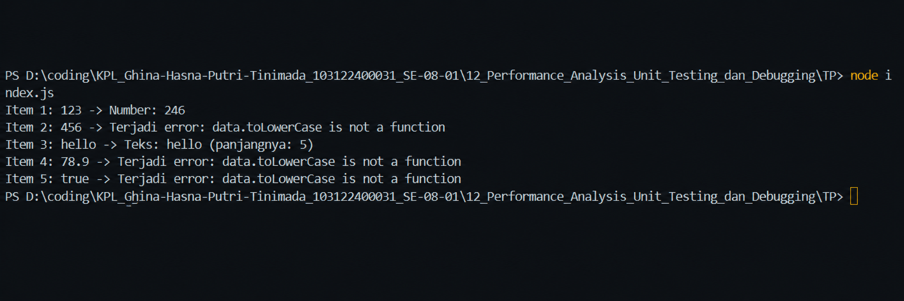

# Tugas Mandiri 12: Performance_Analysis_Unit Testing_ dan_Debugging

  **Nama** : Ghina Hasna Putri Tinimada 
  **NIM** : 103122400031
  **Kelas** : SE-08-01  

## Tugas

Cobalah untuk menangkap kecacatan dalam kode ini

## Program/Kode

[index.js](/.index.js)

## Output

Setelah diperbaiki:

## Deskripsi

Program ini dibuat untuk melakukan pengolahan data yang terdapat dalam sebuah array. Array tersebut berisi beberapa tipe data yang berbeda, yaitu string, number, dan boolean. Program akan membaca setiap data satu per satu, kemudian memprosesnya menggunakan fungsi processData().

Jika data berupa angka dalam bentuk string, program akan mengubahnya menjadi angka dan mengalikannya dengan 2. Jika data berupa teks, program akan mengubah seluruh huruf menjadi huruf kecil (lowercase) dan menampilkan panjang karakter teks tersebut.

Pada versi awal program terdapat bug karena method toLowerCase() digunakan pada semua tipe data, padahal method tersebut hanya dapat digunakan pada tipe data string. Akibatnya program menghasilkan error saat memproses data bertipe number dan boolean.

Untuk mengatasi masalah tersebut, program menggunakan mekanisme try-catch untuk menangkap error yang terjadi selama proses eksekusi. Dengan demikian, program tetap dapat melanjutkan proses ke data berikutnya meskipun ditemukan kesalahan pada salah satu data.

Tujuan Program